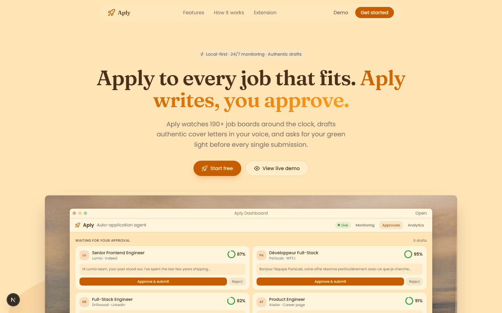
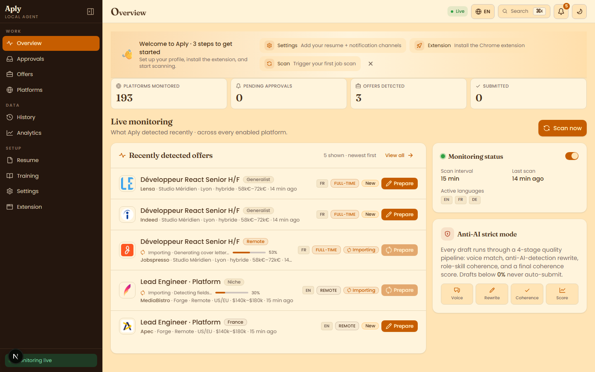
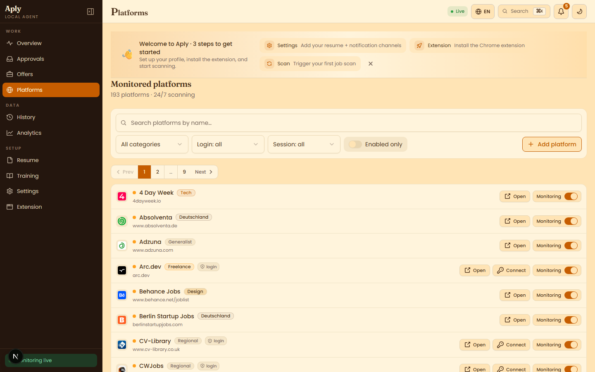
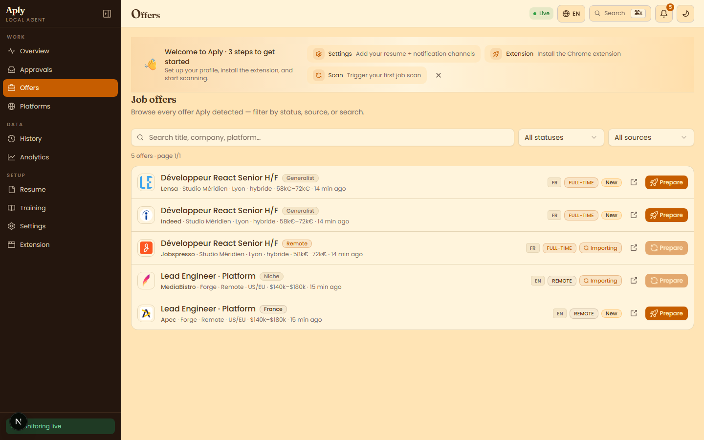
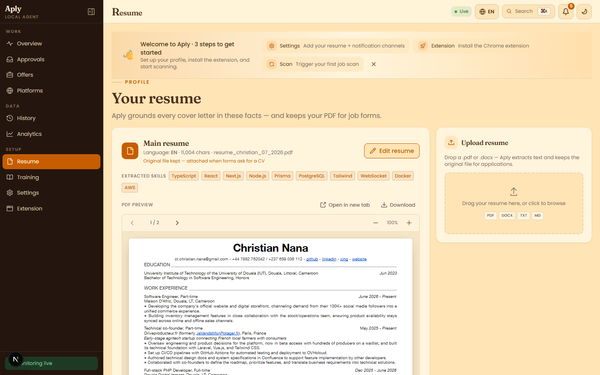
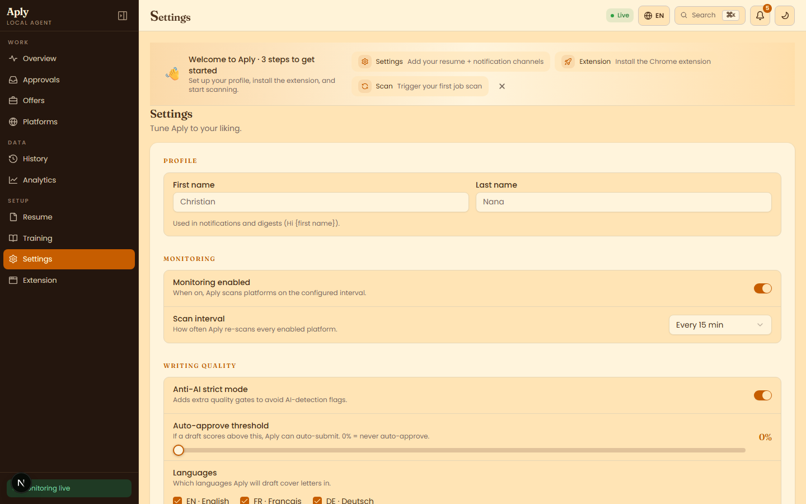
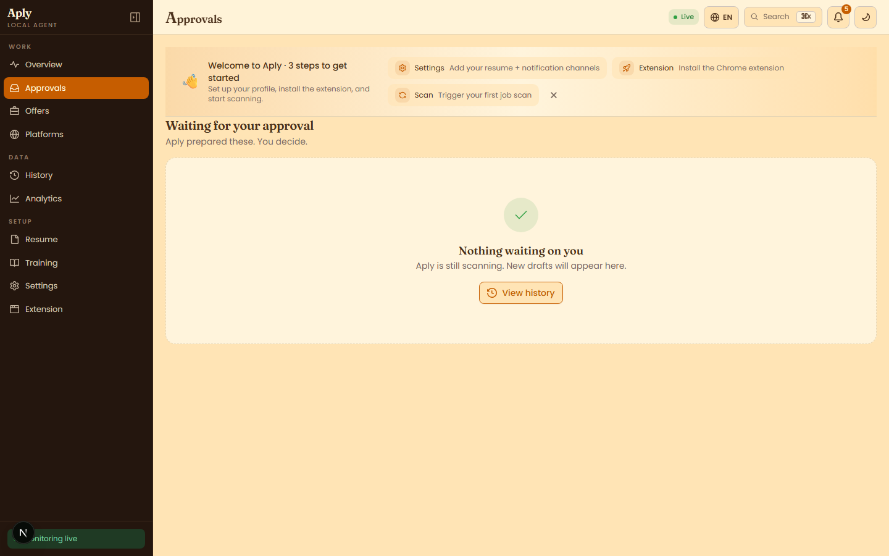

# Aply

**Local-first job-application agent.** Aply watches 190+ job boards around the clock, drafts cover letters in your voice, and asks for your green light before every submission.



## Features

- **24/7 monitoring** across job boards and company career pages
- **Authentic drafts** grounded in your resume, with an anti-AI quality pipeline
- **Human-in-the-loop** approvals before every submit
- **Offers & platforms** browsers with search, filters, and source logos
- **Resume vault** with PDF preview, text extraction, and skills chips
- **Notifications** via Email / WhatsApp (Telegram & Discord coming soon)
- **Local-first** — SQLite, your browser profile, your data

## Screenshots

### Overview

Live monitoring, KPIs, and recently detected offers.



### Platforms

Enable or connect the boards you want scanned.



### Offers

Browse detected jobs, filter by status/source, and prepare applications.



### Resume

Upload a PDF/DOCX, preview the file, and keep extracted text for drafting.



### Settings

Profile, monitoring interval, writing quality, languages, and notification channels.



### Approvals

Review drafts, scores, and approve or reject before submit.



## Stack

- **Next.js** (App Router) + TypeScript + Tailwind + shadcn/ui
- **Prisma** + SQLite
- **Playwright** for browser automation
- **react-pdf** for in-app resume preview

## Quick start

```bash
pnpm install
pnpm browser:install
pnpm db:push
pnpm dev
```

Open [http://localhost:3000](http://localhost:3000) (or the port configured in your scripts).

Copy `.env.example` if present, or create a `.env` with at least:

```env
DATABASE_URL="file:./db/aply.db"
```

Add your LLM provider keys as required by `src/lib/llm`.

## Project layout

```
src/app          # routes + API
src/components   # dashboard UI (aply/*)
src/lib          # scanning, LLM, identity, notify channels
prisma           # schema + migrations
docs/screenshots # README captures
```

## License

Private / all rights reserved unless otherwise noted.
